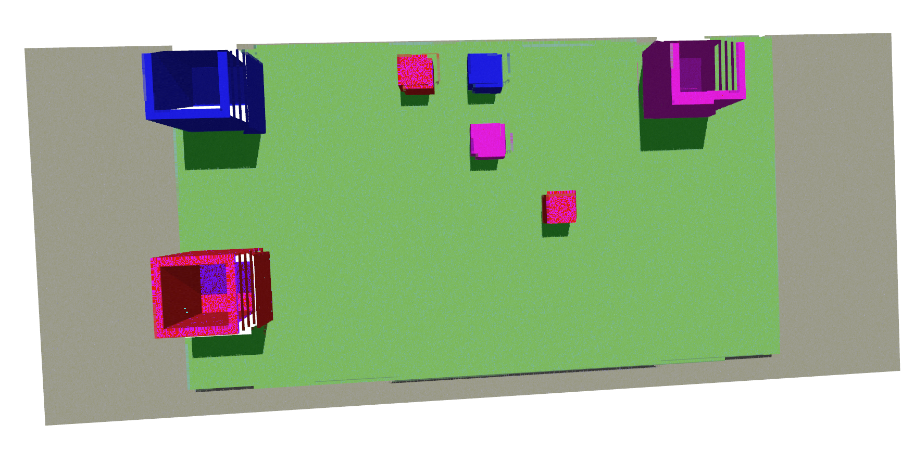
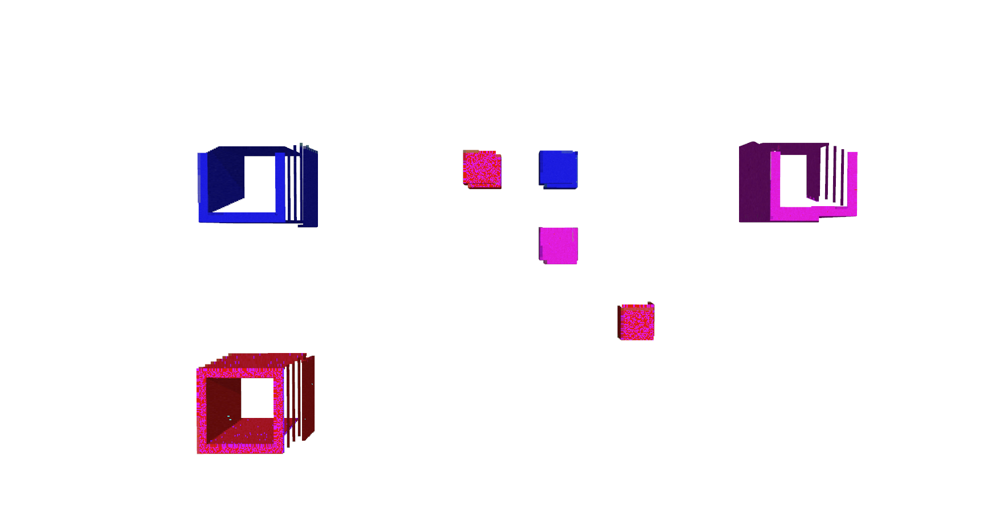
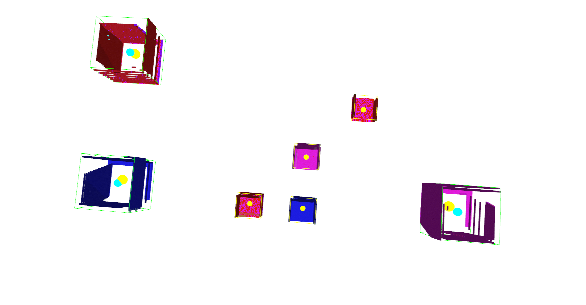

# MoveIt Pick and Place with Point Cloud Perception

## How to Run

Follow instructions on https://github.com/surgical-vision/comp0250_s26_labs, replacing the `cw1_team_x` folder with the provided package.

We have written helper bash scripts for convenience:
- `pbuild.sh` — source and build the workspace
- `plaunch.sh` — launch Gazebo and the solution node
- `task1.sh`, `task2.sh`, `task3.sh` — run each task individually

However, note that they have to be ran from the folder root 

## Task 1: Pick and Place with Known Box and Basket Location

**Video:** [Task 1 Demo](https://drive.google.com/file/d/1SArB1VHXBSYB_4jyHPd2lUUtzYaKIG10/view?usp=sharing)

The service provides the exact pose of a single box and the location of a single basket. Our solution executes a multi-stage pick-and-place sequence using MoveIt:

- The arm opens the gripper and uses `moveToTarget` (MoveIt sampling-based planning) to position above the box at the given coordinates.
- It descends vertically using `moveCartesian`, which computes a Cartesian straight-line path with 50 dense waypoints and a 1mm end-effector step size. If the Cartesian planner achieves less than 95% of the path, it falls back to `moveToTarget`.
- After grasping, the arm lifts, traverses to above the basket, lowers, and releases.
- A `createPose` helper provides a consistent downward-facing end-effector orientation (quaternion [0.9239, -0.3827, 0, 0]) used across all tasks.

## Task 2: Classify Basket Contents by Colour

**Video:** [Task 2 Demo](https://drive.google.com/file/d/1zqXdfZ5ZFCCyIQRB7DHalnlUCJi1JWDy/view?usp=sharing) 

The service provides the world-frame locations of several baskets, each containing a coloured object. Our solution must return the colour (red, blue, or purple) of the object inside each basket.

- For each basket, the arm moves directly above it (Z + 0.4m) and captures a point cloud using the wrist-mounted RGB-D camera.
- Each captured cloud is transformed from the camera's optical frame to the `panda_link0` world frame using TF2 (`tf2::doTransform`), so that the basket's world coordinates can be used directly for the colour query.
- `classifyCentroid` samples all points within a 6cm radius sphere around the basket's known position and applies a colour voting scheme operating in 0–255 uint8 space: it rejects low-saturation points (grey, white, dark shadows) and green (table/basket edges), then counts purple (R > 80, B > 80, G clearly lower), red (R dominant), and blue (B dominant) votes to determine the winner.

## Task 3: Autonomous Colour-Sorted Pick and Place

For Task3, we show 3 consecutive succesful demos: 

- **Video:** [Demo 1](https://drive.google.com/file/d/1mRl_GjyyOi8nxkNBQt5EB2BTwLtblqnB/view?usp=sharing)
- **Video:** [Demo 2](https://drive.google.com/file/d/1HITMlzvXf5_pxiAUpSbHHdiiv6lq-JiW/view?usp=sharing) 
- **Video:** [Demo 3](https://drive.google.com/file/d/1X9-YrBMBtgPp_K1i_yp4cIaQhCkOgoMa/view?usp=sharing) 

No object or basket locations are provided. The robot must discover all boxes and baskets on the table, determine their colours, and place each box in the matching-colour basket.

### Perception Pipeline

Our approach uses a three-stage point cloud processing pipeline, executed entirely in C++ using PCL and ROS2 `PointCloud2` iterators.

**Stage 1 — Multi-View Table Scan**

The arm moves to three overhead positions (centre, left +0.3m in Y, right -0.3m in Y) at a height of 0.7m. At each position it captures an RGB-D point cloud, transforms it to the `panda_link0` frame via TF2, and merges all three into a single combined cloud. This multi-view approach ensures full table coverage, as the camera's field of view from a single position misses objects near the table edges.

**Stage 2 — Table Surface Removal**

The green table surface is identified by thresholding on colour (G > 100, R < 100, B < 100 in uint8). The mean Z of all green points gives the table height. All points below this height plus a 2cm margin are discarded, along with any remaining green points. This cleanly isolates the objects protruding above the table.

**Stage 3 — Clustering and Classification**

Euclidean Cluster Extraction (PCL's implementation, equivalent to DBSCAN) groups the remaining points with a 2cm cluster tolerance and a minimum of 20 points per cluster. Each cluster is classified by its maximum XY bounding box extent: baskets have an extent around 0.1m while boxes are around 0.04m, with 0.06m as the decision threshold. Clusters with colour "none" are discarded as noise.

Colour classification reuses the same `classifyCentroid` function from Task 2, querying the unfiltered combined cloud (which retains full colour information including the lower portions of baskets lost during Z-filtering).

### Pick and Place Execution

Detected objects are returned as a `BoxesAndBaskets` struct containing vectors of `ColoredLocation` (colour string + XYZ centroid). The Z coordinates are overridden to known values (0.03m for boxes, 0.02m for baskets) since the point cloud centroids reflect the visible top surface rather than the grasp/place height.

A colour-to-basket lookup map is built, then for each detected box, the matching basket is found and `pickAndPlace` is called. The pick-and-place motion uses `moveToTarget` for the initial approach (which allows MoveIt to plan a collision-free path and set the correct orientation), followed by `moveCartesian` for all vertical descents, lifts, and the lateral traverse to the basket.

### Accuracy

Detection accuracy was validated against Task 1's ground-truth positions: box centroids are typically within 1–2mm in XY, basket centroids within 2–3cm (with slightly larger errors for baskets near the table edges due to partial visibility) - but this doesnt prevent pick and place tasks being completed. 

### Error Handling

After attempting to place all the boxes in the appropriate baskets, the manipulator scans the table one more time to check if it has missed any blocks, or if it has dropped any of them. If there are any blocks left, it attempts again to complete the task. 

## Work Breakdown

### Task1: Max von Boxberg
### Task2: Hashim Al-Obaidi, Ali Shihab
### Task3: Hashim Al-Obaidi 
